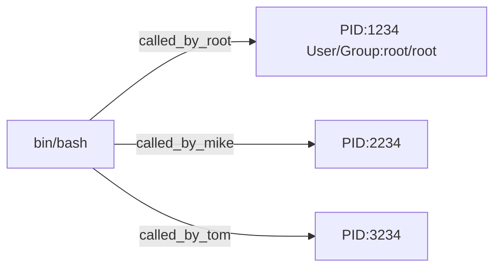

> Note of Charpter 16, VBird Linux

ALl events triggered on Linux can be taken as a process with a given PID, and it is with access permission accorrding to who triggerred the process.

## 16.1 Process and Program
**Binary file**  is a program, one user run the program then a process is triggered with PID.
Each program has three groups of access permission, each group witch coresponding r/w/x access.
So when different user run the same program, will be granted with different permissions.
For example, when root run touch a file, root gets UID/GID =0/0, when common_user run touch, it gets UID/GID = 501/501
Then OS will decide if the process has access permission by PID.




- **Program** : binary program save in hard drive
- **Process** : triggerred by a user, with PID
- **Parent Process** : process and child process, like `touch` is called in bash, then bash is the parent procss

    ```bash
    ps -l
    ```
    return something like below , PPID is parent PID
    ```
    F S   UID     PID    PPID  C PRI  NI ADDR SZ WCHAN  TTY          TIME CMD
    0 S 913142 649467  649457  0  80   0 - 11564 sigsus pts/1    00:00:00 zsh
    4 R 913142 672184  649467  0  80   0 -  3714 -      pts/1    00:00:00 ps
    ```
- **Service/Daemon** : process runing in memory
    such as crond, atd, rsyslogd, normally daemon end with 'd'

### Multi Users Multi Tasks in Linux
- Each logined user gets a sperate shell (default is /bin/bash), which can be configured in file ~/.bashrc.
- Multi login windows (6 text + 1 GUI), witch with ALT + F1...F7


## 16.2 Job Control
Bash environment of tty1 and tty2...tty7 are indepent. Which mean bash can only control jobs running in its own environment.

When a user login with a bash, all commands run in this bash would be child process of this bash, run command in background, so this bash still can be used to run other commands
```bash
cp file1 file2 &
```

Suppose there is only one terminal, commands can run in 
- **Forground**: interactive, with prompt characters
- **Background**: cannot interact with users, no prompt characters, commands can be paused or runing, cannot be stopped by ctrl+c. vim cannot be in background.

### Job control commands:
- Start a command in background , command end with `&`. 
    Combine with data redirect , to save output a log file.
        
    ```bash
    # zip folder /etc, any output would be saved to log file /tmp/log.txt, and run in background
    tar -zpcf /tmp/etc.tar.gz /etc > /tmp/log.txt 2>&1 &
    ```

- Pause current job and send to background `ctrl + z`

- Check all jobs in background `jobs -l`

- Get last job in background to foreground `fg`, if there're over one jobs in background, need to specify which job by *job number* `fg N`

- Start the paused background job `bg ` 

- Kill a background job `kill -signal %jobnumaber`

    ```bash
    # % before jobnumber cannot be omitted
    kill -15 %2 

    common used `signal` : cheak all the signals  `kill -l`
    -1  : reread job's config file
    -9  : force delete a job
    -15 : end the job in a normal way
    ```


Sample : 
Put 2 jobs to background vi , and find in sequence. And get vi to foreground.

```bash
# put 2 jobs to backround
vi ~/.bashrc
ctrl +z
find / -pirnt
ctrl +z
```

Output of `jobs l`

```bash
# + means the last one put to background, - means the second last put to background
[1]- Stopped    vi ~/.bashrc
[2]+ Stopped    find / -pirnt   
```
    
Get vi to foreground again

```bash
# %1 is the job number
fg 1
```

### Offline job management
Previous meaned forground/background is bounded to terminal, not system background job, if you remotely ssh to a linux system, start a background job , but exit remote login before the job ends, then job would also end. If you want the job to continue after you logout, then try `nohup`


## 16.3 Process Management

Check current process status statically.

   > ```bash
   > # prcesses only related with current shell
   > ps -l
   > # including system process
   > ps aux
   > ```

Check process status dynamically.
    `top`, `htop`, `pstree`    

Control process by send a signal, check all signals with `kill -l`.

`kill -signal %jobnumber` or `kill -signal PID`
If want to send signal to a process, need to konw the job number or PID, so command `kill` normally combined with `ps`.

Or use `killall` and command name.

`killall -i -9 bash`

`free -h` Check system memory resource(-h system decide memory unit)

`uname -a` info about system and kernal version

## 16.4 Special file and process

`/proc` , all processes are in memory, and memory data is writen to directory `/proc`.
`/proc/PID`, so systemd's data is saved to `/proc/1/`, as systemd is the first process when OS started, its PID is 1.


